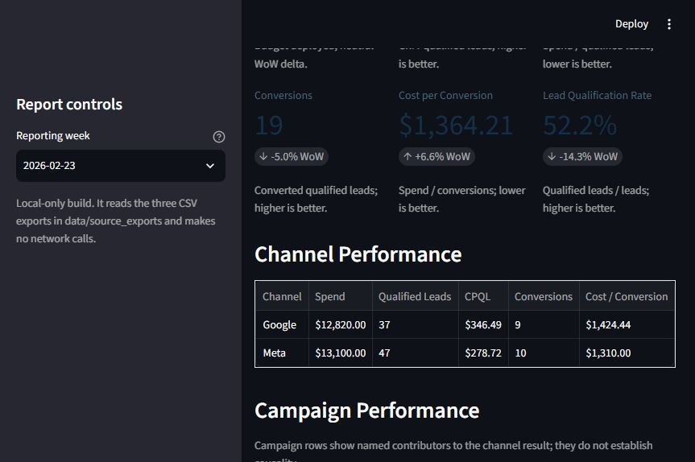
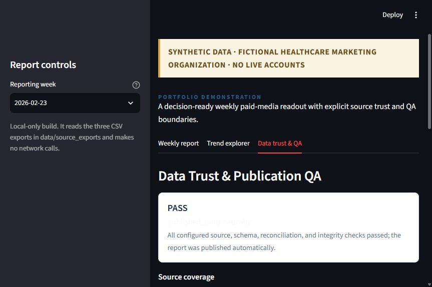

# Healthcare Marketing Weekly Performance Readout

An interactive Streamlit readout for a fictional healthcare marketing organization. It turns three synthetic weekly exports—Google Ads, Meta Ads, and CRM—into a concise performance view with explicit data-quality and publication boundaries.





## Why this project is useful

This is a portfolio demonstration of the work between raw marketing exports and a trustworthy weekly review:

- Normalizes platform-specific CSV shapes into a common reporting model.
- Reconciles CRM lead records to a canonical synthetic campaign catalog.
- Excludes invalid rows from KPI rollups while preserving warnings for inspection.
- Separates performance movement from data-integrity problems.
- Keeps trend calculations and rolling ratios tied to trusted rows.
- Makes publication status visible instead of hiding uncertainty behind a polished chart.

The public build is intentionally local-first. It uses the existing deterministic analytics, pipeline, trend, observation, evaluation, and QA modules from the weekly readout demo, while leaving out auth-backed multi-tenant operations and private development artifacts.

## Six headline KPIs

The report exposes the requested six-KPI set:

1. Spend
2. Qualified Leads
3. CPQL (cost per qualified lead)
4. Conversions
5. Cost per Conversion
6. Lead Qualification Rate

Channel and campaign tables repeat the outcome and efficiency measures so a reviewer can trace the headline movement to named synthetic contributors without treating that trace as causal proof.

## Synthetic data and safety boundary

Every bundled record is fictional and generated for demonstration. There are no live ad-platform connections, CRM credentials, patient records, clinical data, production identifiers, API keys, or external network calls. The app is not a clinical system and does not make healthcare decisions.

The CRM-to-campaign match is a proof-of-concept attribution assumption: a lead is counted when its `tracked_campaign` alias maps to the canonical synthetic campaign in the same reporting week. It is not a full marketing attribution model.

## Stack

- Python
- Streamlit
- Standard-library CSV processing and dataclasses
- Deterministic validation, KPI calculation, trend, observation, evaluation, and publication-QA modules

## Run locally

```powershell
python -m venv .venv
.\\.venv\\Scripts\\Activate.ps1
python -m pip install -r requirements.txt
streamlit run app.py
```

Open the local URL printed by Streamlit. The default view selects the latest bundled week, `2026-02-23`.

Run the focused checks with:

```powershell
python -m unittest discover -s tests -v
python -m compileall -q app.py src tests
```

## Repository map

```text
app.py                         Streamlit portfolio surface
data/source_exports/            Synthetic Google, Meta, and CRM CSVs
src/pipeline.py                Ingestion, normalization, validation, reconciliation
src/analytics.py               Weekly KPI rollups and WoW changes
src/trends.py                  Six-KPI trend series and rolling calculations
src/observations.py            Evidence-backed movement classification
src/qa.py                      Deterministic publication routing
src/evaluation.py              Repeatable dataset integrity checks
tests/                         Focused public-build tests
docs/assets/                   Captured UI evidence
```

## Professional scope

This repository is designed to be reviewed as a complete small product surface: requirements are visible in the UI, trust assumptions are documented, the data path is inspectable, and the app runs without private services. It is deliberately not presented as a claim of live campaign access or unaided production engineering.
